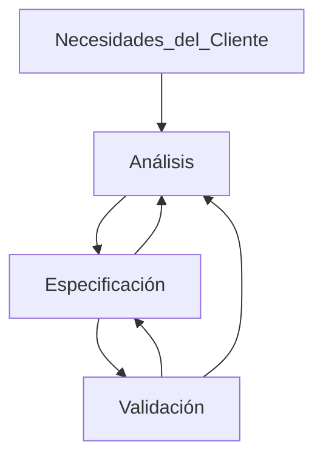

## Introducción

El software => Colección de programas, procedimientos, documentación y datos asociados que determinan la operación de un sistema de computación  

Las fallas de software siempre estuvieron presentes desde su desarrollo. No así las fallas mecánicas o eléctricas que son por el deterioro del tiempo. Es decir que la falla de software estuvo presente desde el principio, solo que nunca se había manifestado

El mantenimiento del software suele costar mas que el desarrollo y su motivo es para:
- Corregir errores residuales (Updates) => Mantenimiento Correctivo
- Mejorar funcionalmente el software y adaptarlo a los cambios del entorno (Upgrades) => Mantenimiento Adaptativo

La *Ingeniería del Software* es una aplicación de un enfoque sistemático, disciplinado y cuantificable al desarrollo, operación y mantenimiento del software
Un **Enfoque Sistemático** es una metodología y practicas existentes para solucionar un problema dentro de un dominio determinado. De esta forma podemos repetir dicho procedimiento y estimar los resultados

#### Enfoque

El enfoque de la *Ingeniería del Software* viene del problema de producir un software determinado por la idea de satisfacer las necesidades del cliente. El objetivo básico de la *IS* es buscar el **CYP**(calidad y productividad), los cuales están rodeados del triangulo de hierro formado por la tecnología, la gente y el proceso. Pero tenemos otros factores que también modifican este enfoque:
1. Escala
2. Calidad
3. Productividad
4. Consistencia
5. Cambios

#### Escala
La *Ingeniería del software* debe tener en cuenta la escala del software a desarrollar, ya que no siempre los métodos para solucionar pequeños problemas funcionan con problemas de mayor magnitud. Por ende, estos métodos deben tener la capacidad de adaptación y respuesta del mismo a medida que aumenta la cantidad de usuarios o requerimientos al mismo. Para ello hay 2 claras dimensiones a considerar:
- Métodos de Ingeniería
- Administración del Proyecto
Los cuales en sistemas pequeños ambos pueden ser informales, pero al tratarse de un sistema grande, ambos deben ser formales 

**¿Qué es un sistema grande o chico?**

| Pequeño   | Mediano         | Grande            | Muy Grande  |
| --------- | --------------- | ----------------- | ----------- |
| < 10 KLOC | < 10 a 100 KLOC | < 100 a 1000 KLOC | > 1000 KLOC |

#### Productividad
Un software que demora mucho tiempo en ser entregada o uno barato y de mala calidad son inaceptables. El costo del software se mide en Persona/Mes. La productividad asocia estas 2 ideas de forma tal que $\text{Si es mas alta} => \text{menor costo}/\text{Menor Tiempo}$ (aunque también dependa de la cantidad de personas)

#### Calidad
Claramente desarrollar software de alta calidad es otra motivación de la *Ingeniería del Software*, aunque la calidad de un software es difícil de definir. Su definición estándar se basa en 6 aspectos:
1. Funcionalidad: Capacidad de proveer funciones que cumplen las necesidades establecidas
2. Confiabilidad: Capacidad de realizar las funciones necesitadas en un tiempo determinado 
3. Usabilidad: Capacidad de ser comprendido, aprendido y usado
4. Eficiencia: Capacidad de proveer desempeño apropiado en base a la cantidad  de recursos usados 
5. Mantenibilidad: Capacidad de ser modificado con el propósito de corregir,mejorar o adaptar
6. Potabilidad: Capacidad de ser adaptado a otro entorno sin necesidad de realizar muchos cambios

Este concepto de realidad tiene muchas dimensiones como para reducirlo a un solo número, por ello cada en proyecto se elige que sera calidad para este, enfocándose en uno de los aspectos anteriores como principal. Normalmente se elige Confiabilidad. Se tienen 2 formas de medir la Confiabilidad
1. $\text{+fallas} = -\text{confiable}$
2. $\text{Calidad} = \text{Cantidad de defectos en software}/\text{tamaño}$

Normalmente el calculo seria  < 1 defecto /KLOC

#### Consistencia y repetitividad
Algunas veces un grupo puede desarrollar un software de buena calidad. Un objetivo clave de la *Ingeniería del software* es la sucesiva producción de sistemas de alta calidad y con alta productividad. Esta consistencia es la que nos permite predecir el resultado del proyecto con certeza razonable. Sin esta consistencia seria imposible estimar costos 

#### Cambios
El software debe cambiar para adaptarse a los cambios de la institución/empresa. Las practicas de la *IS* deben preparar al software para que estos cambios no sean abruptos, es decir que este sea fácilmente modificable. Los métodos que producen alta calidad, si no permiten cambios, no son útiles

La *IS* se enfoca mayormente en el proceso para conseguir los objetivos de calidad y productividad, siendo el **enfoque sistemático** el proceso que se utiliza.
La *IS* separa el proceso para desarrollar software del producto en si desarrollado. El proceso es quien determina en gran medida la **CYP**. Diseñar el proceso apropiado y su control es el desafió clave de la *IS*

#### El proceso de desarrollo en fases
El proceso de desarrollo consiste en varias fases, las cuales tienen una salida definida. Estas fases se realizan en el orden especificado por el modelo de procesos que se elija seguir. EL motivo de separar el desarrollo en fases es la *separación de incumbencias*: donde cada fase manipula distintos aspectos del desarrollo de software. Además cada fase permite verificar la calidad y el progreso al terminar. Este enfoque de desarrollo en fases es central en el enfoque de la *IS* para solucionar la solucionar la crisis de software

Estas fases en general son:
1. Análisis y especificación de los requerimientos
2. Arquitectura
3. Diseño
4. Codificación
5. Testing
6. Entrega y instalación 

Los enfoques sistemáticos necesitan que cada etapa se realice de forma rigurosa y formalmente

#### Administración del Proceso 
La administración del proceso establece cómo asignar los recursos a las distintas tareas, cómo organizarlas temporalmente, cómo asegurar que cada fase se desarrollo apropiadamente,etc. Sin la administración del proceso es virtualmente imposible cumplir con los objetivos de **CYP**. El planeamiento del proyecto es central en la administración del proyecto para poder determinar cuestiones como:
- ¿El proyecto se está desarrollando a término?
- ¿El proyecto procede acorde al presupuesto?
- ¿Se esta cumpliendo con los objetivos de calidad?
Las cuales son importantes para poder planear y administrar las métricas y medidas 

## Análisis y especificación de los requerimientos

En problemas pequeños es mas fácil comprender y especificar los requerimientos, en problemas grandes, en cambio, es mas difícil ya que hay grandes posibilidades de cometer un error

*Identificar y especificar* los requisitos necesariamente involucra interacción con la gente, no puede automatizarse. La fase de requisitos termina produciendo un documento con la especificación de los requerimientos del software(**SRS**). Es decir que esta **SRS** especifica lo que el sistema propuesto debe hacer 

##### ¿Pero, por que es tan importante la SRS?

La *SRS* establece las bases para el acuerdo entre el cliente/usuario y el desarrollador. En esta tenemos 3 partes involucradas:
- Cliente => Tiene necesidades
- Usuario => Tiene consideraciones 
- Desarrollador  => Debe entender lo que intentan comunicar el cliente y el usuario

Normalmente hay una brecha comunicacional entre estas partes ya que el:
- Cliente: No comprende el proceso de desarrollo de software
- Desarrollador: NO conoce el problema del cliente ni su área de aplicación 

La SRS es el medio para reconciliar las diferencias y especificar las necesidades del
cliente/usuario de manera que todos entiendan.

>[!INFO]- *Requerimiento* 
>- Una condición o capacidad necesaria de un usuario para solucionar un problema o alcanzar objetivos
>- Una condición o capacidad que debe poseer o cumplir un sistema

Estos requerimientos son difíciles de entender/discernir ya que visualizar el futuro sistema es complicado, al igual que visualizar sus capacidades. Además estos requerimientos cambian con el tiempo, por lo cual es muy importante realizar correctamente la SRS 

Principalmente por las siguientes 5 razones:
1. Ayuda al usuario a comprender sus necesidades
2. Los usuarios no siempre saben lo que quieren o necesitan. Deben analizar y comprender el potencial del sistema
3. EL proceso de requerimientos ayuda a aclarar las necesidades 
4. La SRS provee una referencia para la validación del producto final
5. Debería dar una clara comprensión de lo que se espera

>[!attention] Una SRS de alta calidad es esencial para obtener software de alta calidad

Los errores de requerimiento sólo se manifiestan en el software final. Para satisfacer los objetivos de calidad, se debe comenzar con una SRS de calidad 

Una buena SRS reduce los costos de desarrollo ya que a medida que avanza el proyecto, corregir los errores en la SRS es mas caro llegando a costar hasta un %40.

|            Phase            | Cost(person/hours) |
| :-------------------------: | :----------------: |
|       Requerimientos        |         2          |
|           Diseño            |         5          |
|        Codificación         |         15         |
|           Testing           |         50         |
| Instalación y mantenimiento |        150         |

#### Proceso de Requerimientos
*Proceso de Requerimientos* => Secuencia de pasos que se realizan para convertir las necesidades del usuario en una SRS. Este proceso debe recolectar las necesidades y los requerimientos y especificarlos claramente. Se puede dividir en 3 actividades:
1. ==Análisis del problema o requerimientos== => Más difícil ya que exige la recolección y extracción de estos
2. Especificación de los requerimientos
3. Validación 

Este proceso no es lineal, es iterativo y en paralelo. Hay superposición entre las fases (algunos requerimientos pueden estar siendo especificados mientras otros son analizados). Muchas veces especificar un requerimiento ayuda a su análisis; mientras que la validación puede mostrar brechas entre el análisis y su especificación 

La transición del análisis a la especificación es complicada. La especificación se enfoca en el comportamiento externo, mientras que el análisis tiene como objetivo comprender la estructura del problema y su dominio, sus componentes, entradas y salidas; además que en esta se recolecta mas información de la necesaria para la especificación 

El uso del análisis y las estructuras que lo construyen puede ser indirecto, ayudando a comprender en lugar de asistir a la especificación 

#### Análisis de los requerimientos 
El análisis se enfoca en la comprensión del sistema deseado y sus requerimientos. Normalmente se aplica un *Divide y vencerás*, es decir se divide el problema en partes mas pequeñas y se intenta comprender estas mini partecitas y su relación entre ellas
Normalmente se generan grandes cantidades de información, la cual debe ser organizada para su entendimiento; para ello se suelen usar métodos como diagrama de flujo de datos, diagrama de objetos, etc.

El análisis incluye: 
- Entrevistas con clientes y usuarios 
- Lecturas de manuales 
- Estudio del sistema actual
- Ayudar al cliente/usuario a comprender nuevas posibilidades 

El analista no solo se encarga de recolectar información, sino también como consultor. Debe tener muy buenas habilidades  comunicativas para construir relaciones interpersonales.  Otras cuestiones importantes que debe hacer el analista :
- Obtener la información necesaria 
- Brainstorming: Interactuar con el cliente para establecer las propiedades deseadas 
- Organizar información dado que recolecta gran cantidad de esta 
- Asegurar completitud
- Asegurar consistencia 
- Evitar diseño interno 

Hay 3 enfoques/métodos para analizar los subproblemas y sus relaciones:
1. Funciones: análisis estructural
2. Objetos: análisis orientado a objetos 
3. Eventos del sistema: particionado en eventos

###### Enfoque Informal 
Además se nos presenta el *Enfoque informal* en el cual no hay una metodología definida, la información se obtiene mediante el análisis, el dialogo, la observación, etc y se plasma y organiza en la *SRS* sin formalidades. Puede ser útil en muchos casos pero se sostiene completamente en la experiencia del analista y el feedback provisto por el cliente 

###### Modelado de flujo de datos 

- Es ampliamente utilizado
- Se centra en las funcionalidades del sistema, no en lo que no hace
- Ve al sistema como una red de transformadores de datos
- Para el modelado se utilizan diagramas de flujo de datos

Un *DFD* o diagrama de flujo de datos es una representación grafica del flujo de datos atraves de un sistema, es un gráfico lógico del plan de trabajo que se ejecutará para la solución de un determinado problema. Se enfoca en que hacen los transformadores y no en como lo hacen, por lo que normalmente se muestran las entradas y salidas mas importante, obviando algunas. No hay loops ya que no presenta la noción de control de flujo de datos, no hay *IF's* por ejemplo.

Estos *DFD* presentan un diccionario de datos, el cual es simplemente una forma de describir mas detalladamente los datos que fluyen entre los transformadores, en estos se pueden usar expresiones regulares  

Los pasos del **Método de análisis estructurado** son:
1. Dibujar el diagrama del contexto
2. Dibujar el DFD del sistema existente
3. Dibujar el DFD del sistema propuesto e identificar la frontera hombre-máquina

###### Modelado Orientado a objetos 
Ventajas:
- Mas fácil de hacer y entender 
- La transición del análisis orientado a objetos al diseño orientado a objetos parece ser mas simple
- Es mas resistente/adaptable a cambios ya que los objetos son mas estables que las funciones 

En este método el sistema es visto como un conjunto de objetos interactuando entre si, o con el usuario a través de servicios(métodos) que cada objeto provee. Lo que buscamos es:
1. Identificar las clases del dominio 
2. Definir dichas clases identificando sus atributos y métodos
3. Identificar las relaciones entre dichas clases sea a través de jerarquías o de los métodos

###### Prototipado 

Se construye un sistema parcial prototípico. Lo desarrolladores, clientes y usuarios lo utilizan para comprender mejor el problema y las necesidades sirviendo de ayuda visual al sistema final. Este prototipo puede ser descartable o evolutivo, siendo el primero de estos el mas utilizado 

#### Especificación de los requerimientos 

Al terminar la etapa de especificación nuestra salida es la *SRS*, construida en base al conocimiento adquirido durante la etapa de Análisis pero enfocado en el comportamiento externo del sistema . Cabe aclarar que l *SRS* no es una formalización del modelo anterior, sino que se construye en base a este. 

**Características de una SRS:**
- Correcta
	- Cada requerimiento representa precisamente alguna característica deseada por el cliente en el sistema final.
- Completa
	- Todas las características deseadas por el cliente están descriptas. La característica más difícil de lograr, para conseguirla uno debe detectar las ausencias en la especificación. Corrección y completitud están fuertemente relacionadas.
- No ambigua 
	- Si para cada requerimiento existe un solo significado. Si es ambigua los errores se colarán fácilmente. La no ambigüedad es esencial para verificabilidad. Como la verificación es usualmente hecha a través de revisiones, la SRS debe ser comprensible, al menos por el desarrollador, el usuario y el cliente. Particular atención si se usa lenguaje natural. Los lenguajes formales ayudan a “desambiguar”.
- Consistente
	- Ningún requerimiento contradice a otro
- Verificable 
	- Si existe para cada requerimiento algún proceso efectivo que puede asegurar que el software final satisface el requerimiento.
- Rastreable
	- Se debe poder determinar el origen de cada requerimiento y cómo éste se relaciona a los elementos del software. Hacia adelante: dado un requerimiento se debe poder detectar en qué elementos de diseño o código tiene impacto. Hacia atrás: dado un elemento de diseño o código se debe poder rastrear que requerimientos está atendiendo.
- Modificable
	- Si la estructura y estilo de la SRS es tal que permite incorporar cambios fácilmente preservando completitud y consistencia. La redundancia es un gran estorbo para modificabilidad, puede resultar en inconsistencia.
- Ordenada en aspectos de importancia y estabilidad
	- Los requerimientos pueden ser críticos, importantes pero no críticos, deseables pero no importantes. Algunos requerimientos son esenciales y difícilmente cambien con el tiempo. Otros son propensos a cambiar. => Se necesita definir un orden de prioridades en la construcción para reducir riesgos debido a cambios de requerimientos

**¿Que debe tener una SRS?**
- Requerimientos de Funcionalidad
- Requerimientos de desempeño
- Restricciones de diseño
- Requerimientos de interfaces externas
###### Requerimientos de Funcionalidad
Es el corazón de la *SRS*, conforma la mayor parte de la especificación. Especifica toda las funcionalidades que el sistema debe proveer. Las salidas que se deben producir para cada entrada dada y las relaciones entre ellas. También describe todas las operaciones que el sistema debe realizar, las entradas validas y las verificaciones de validez para entrada y salida. Y especifica el comportamiento del sistema en caso de entradas invalidas, errores de calculo, es decir de situaciones anormales o situaciones normales con imposibilidades de seguir operando por x razón 
###### Requerimientos de desempeño
Se dividen en *Requerimientos dinámicos* los cuales especifican restricciones sobre la ejecución como:
- Tiempo de respuesta
- Tasa de transferencia o rendimiento
- etc.
En general se especifican los rangos aceptables de distintos parámetros, en casos normales y extremos

Y en los *Requerimientos estáticos* o de capacidad los cuales no imponen restricción en la ejecución como:
- Cantidad de terminales admitidas
- Cantidad de usuarios en simultaneo
- Etc.
Todos estos requisitos se especifican en términos medibles para ser verificados 

###### Restricciones de diseño
Existen factores en el entorno del cliente que pueden restringir las elecciones de diseño como limitaciones de hardware por ejemplo. 
###### Restricciones de interfaces externas 
Todas las interacciones del software con gente, hardware, y otro software debe especificarse claramente. Cabe recalcar que la interfaz del usuario debe recibir atención adecuada creando un manual preliminar indicando los comandos del usuario, los formatos de las pantallas, etc. Estos requerimientos también deben ser precisos para asegurar la verificabilidad.

###### Lenguajes de especificación 

Los lenguajes de especificación deben facilitar la escritura y entendimiento de la *SRS*, a la vez de ser fáciles de aprender. Normalmente se utiliza el lenguaje natura apoyado en documentos estructurados para reducir imprecisiones y ambigüedades, ya que este mismo, si bien es entendido por el cliente como por el desarrollador, puede ser muy ambiguo. Las notaciones formales se utilizan en propiedades especificas del sistema o en sistemas críticos 

###### Casos de Uso 

Un caso de uso captura un contrato entre el usuario y el comportamiento del sistema como *interacción*. Útil en la recolección de requerimientos ya que a los usuarios les agrada, comprenden el formato y reaccionan a este fácilmente. Son colecciones de muchos escenarios donde estos escenarios pueden llamar a otros casos de uso, organizando así jerárquicamente los casos de uso. Los casos de uso solo forman la parte funcional de la *SRS*
**Conceptos Básicos:** 
- Actor: Una persona o sistema diferente que interactúan con el sistema propuesto para alcanzar un objetivo. Los actores son entidades lógicas, por lo cual un actor transmisor y uno receptor son diferentes, aun si hacen referencia al mismo individuo
	- Actor primario: Es quien inicia el Caso de Uso, y este debe satisfacer su objetivo
	- Actor secundario: Es alguien que puede realizar la ejecución real en vez del actor primario, pero no tiene relación directa con el objetivo del caso de uso
- Escenario: Es un conjunto de acciones realizadas con el fin de alcanzar un objetivo bajo determinadas condiciones. Un paso es una acción lógicamente completa realizada tanto por el actor como por el sistema (Es una interacción entre el usuario y el sistema)
	- Escenario exitoso principal:  cuando todo funciona correctamente y se alcanza el objetivo
	- Escenario alternativo/excepcional: Cuando algo sale mal y el objetivo no puede ser alcanzado 

**Elaboración de casos de uso:**
1. Actores y objetivos:
	- Preparar una lista de actores y objetivos
	- proveer un breve resumen de cada caso
2. Escenarios exitosos principales:
	- Por cada cado de uso extender el escenario principal, proveyendo el comportamiento principal del sistema con este (puede revisarse para ver que satisface el interés de los participantes y actores)
3. Condiciones de falla:
	- Identificar y listar condiciones de falla para cada caso de uso
4. Manipulación de Fallas (maybe lo mas dificil):
	- Especificar el comportamiento del sistema para cada condición de falla

**Errores comunes:**
- Debe haber *interacción* entre los escenarios exitosos (Entre cada paso)
- Un caso de uso nunca puede ser iniciado por el sistema
- Los escenario excepcionales siempre deben hacer referencia a un punto del exitoso donde el sistema chequea algo 
- Las precondiciones de casos generales deben implicar las de los casos que se referencias adentro
- Seguir sintaxis dada en clase
- No hay lógica de programación (If's, loops, etc.)

###### Validación de requerimientos

Debido a la misma naturaleza de esta etapa, hay muchas posibilidades de malentendidos. Mientras mas se avanza en el desarrollo mas caro es corregir y encontrar dichos errores, por lo cual arreglarlos en esta etapa es crucial 
La *SRS* se revisa por un grupo de personas conformado por: autor, cliente, representantes de usuarios y de desarrolladores, donde deben estar los *clientes* y *usuarios*.
Existen herramientas para el modelado y análisis de especificaciones 

###### Métricas

Para poder estimar costos y tiempos y  planear el proyecto se necesita "medir" el esfuerzo que demandará. Este depende de muchos factores; principalmente el *tamaño*. Al principio el tamaño solo puede ser estimado. 
Una métrica es importante sólo si es útil para el seguimiento o control de costos, calendario o calidad. Por ende necesitamos una unidad de tamaño que se pueda computar a partir de los requerimientos: ¿El tamaño de la SRS?, no, ya que depende mucho del autor. 

Por lo cual se utiliza: **Punto Función**, siendo una estimación similar a la métrica por LOC que se determina sólo con la SRS definiendo el tamaño en términos de la "Funcionalidad":
- Entradas externas a la aplicación
- Salidas externas que deja el sistema
- Archivos lógicos internos
- Archivos de interfaz externa 
- Transacciones externas 

|    ==Tipo de Funciones==     | ==Simp== | ==Prom.== | ==Comp-== |
| :--------------------------: | :------: | :-------: | :-------: |
|      Entradas Externas       |    3     |     4     |     6     |
|       Salidas externas       |    4     |     5     |     7     |
|  Archivos lógicos internos   |    7     |    10     |    15     |
| Archivos de interfaz externa |    5     |     7     |    10     |
|    Transacciones externas    |    3     |     4     |     6     |

Debemos contar cada tipo de función diferenciando según sea compleja, promedio o simple teniendo en cuanta que $C_{ij}$ denota la cantidad de funciones tipo $i$ con complejidad $j$ en la formula de Punto función no ajustado (UFP):$$\sum^5_{i=1}{\sum^3_{j=1}w_{ij}C_{ij}}$$
Luego debemos ajustar UFP de acuerdo a la complejidad del entorno. Se evalúa según las siguientes características:
1. comunicación de datos 
2. procesamiento distribuido 
3. objetivos de desempeño 
4. carga en la configuración de operación 
5. tasa de transacción 
6. ingreso de datos online 
7. eficiencia del usuario final 
8. actualización online 
9. complejidad del procesamiento lógico 
10. reusabilidad 
11. facilidad para la instalación 
12. facilidad para la operación 
13. múltiples sitios 
14. intención de facilitar cambios

El factor de ajuste de complejidad (CAF) se calcula como $$0.65+0.01*\sum^{14}_{i=1}{p_i}$$
Y los Puntos función = CAF * UFP

Hay que recalcar que la calidad de la *SRS* tiene impacto directo en los costos del proyecto. Por lo cual tener buenas métricas para evaluar es algo necesario. Existen:
- Métricas de *calidad directa*: Evalúan la calidad del documento estimando el valor de los atributos de calidad de la *SRS*
- Métricas de *calidad indirecta*: Evalúan la efectividad de las métricas del control de calidad usadas en el proceso en la fase de requerimientos

## Arquitectura del Software 

La *Arquitectura del software* de un sistema es la estructura del sistema que comprende los elementos del software, las *propiedades externamente visibles* de tales elementos y la relación entre ellas. Por cada elemento sólo interesan las propiedades externas necesarias para especificar las relaciones, **no** son importantes los detalles de cómo se aseguran dichas propiedades. En general en un sistema se tienen varias estructuras que coinciden en algún punto. Una descripción arquitectónica del sistema describe distintas estructuras del sistema

La *arquitectura* es el diseño del mas alto nivel, donde se hacen las elecciones de tecnología, productos a utilizar, servidores, etc. Divide al sistema en partes lógicas tal que cada una puede ser **comprendida independientemente**, describiendo también la relación entre ellas. Hay muchas estructuras diferentes que proveen diferente visión del sistema

La arquitectura del software ayuda muchísimo a:
- Comprensión y comunicación: Al mostrar la estructura de alto nivel del sistema ocultando su complejidad, facilita la comunicación definiendo un marco de comprensión común entre los interesados siendo de mucha ayuda para las negociaciones, acuerdos y comprensión del sistema existente
- Reúso: Una forma de reúso es componer el sistema con partes existentes, lo cual se facilita si a un alto nivel se reúsan componentes que proveen un servicio completo. Por lo cual se elige una arquitectura tal que las *componentes existentes encajen* adecuadamente con otras componentes a desarrollar. Estas decisiones sobre el uso de componente se toman en el momento de diseñar la arquitectura 
- Construcción y evolución: La división provista por la arquitectura servirá para *guiar* el desarrollo del sistema. Ayuda a asignar equipos de trabajos a diferentes partes independientes, además de facilitar la elección de cuáles partes necesitas cambiarse durante la evolución del software contribuyendo a decidir cuál es el impacto de dichos cambios
- Análisis: Es deseable que propiedades de *confiabilidad y desempeño* puedan determinarse en el diseño de alto nivel, permitiendo considerar distintas alternativas de diseño hasta encontrar los niveles de satisfacción deseados. Lo cual requerirá descripción precisa de la arquitectura así como de las propiedades de las componentes 

###### Vistas de la Arquitectura

Una vista consiste de elementos y relaciones entre ellos, describiendo una estructura. Los elementos de dicha vista dependen de lo que la vista quiera destacar, por lo que distintas vistas exponen diferentes propiedades. Logrando reducir la complejidad con la que debe encontrarse el lector 
**Tipos de vista:**
- Módulo  =>  Los elementos son módulos, es decir, no representan unidades en ejecución (ej: clases, paquetes, métodos) y la relación entre ellos está basada en el código(ej: "parte de", "usa a")
- Componentes y conectores => Los elementos son entidades de ejecución denominados componentes(objetos, procesos, etc.), y sus conectores proveen el medio de interacción entre as componentes 
- Asignación de Recursos => Se enfoca en cómo las unidades de software se asignan a recursos. Exponen propiedades estructurales como qué proceso ejecuta en qué procesador, qué archivo reside donde, etc. 

![[Pasted image 20250914172743.png]]

Una descripción arquitectónica consiste de vistas de distintos tipos, cada una mostrando una estructura diferente. Normalmente la vista de Componentes y Conectores es la principal

###### Vista de Componentes y Conectores

Tiene 2 elementos principales, los componentes y los conectores. Esta vista describe qué componentes existen y como interactúan entre ellos en ==tiempo de ejecución==. Prácticamente es un grafo donde los componentes son nodos y los conectores aristas

**Componentes:** Son unidades de cómputo o de almacenamiento de datos, cada componente tiene un nombre y tipo
**Conectores:** Describen el *medio* en el cual la interacción entre componentes toma lugar- Estos tienen nombre y tipo. Muchas veces estos conectores representan protocolos

###### Estilos Arquitectónicos

Sistemas distintos tienen estructuras CyC(Componentes y conectores) distintas, algunas estructuras son generales y son útiles para una clase de problemas, estos son llamados estilos arquitectónicos. Un estilo arquitectónico define una familia de arquitecturas que satisface restricciones de ese estilo. Distintos estilos pueden fusionarse para generar una nueva arquitectura 

**Tubos y Filtros:** Adecuado para sistemas que fundamentalmente realizan *transformaciones de datos*. Un sistema que utiliza este estilo usa una red de transformadores para realizar el resultado deseado. Esta compuesto por un solo tipo de componente: filtro y un solo tipo de conector : tubo. Un filtro realiza transformaciones y le pasa los datos a otro filtro por un tubo 
**Restricciones:**
- Un filtro es una entidad independiente y asincrónica
- Un filtro no necesita saber la identidad de los filtros que envían o reciben datos
- Un tubo es un canal de redirección unidireccional que transporta un flujo de un filtro a otro
- Un tubo sólo conecta 2 componentes
- Lo filtros deben hacer "buffering" y sincronización para asegurar el correcto funcionamiento como productor y consumidor 
