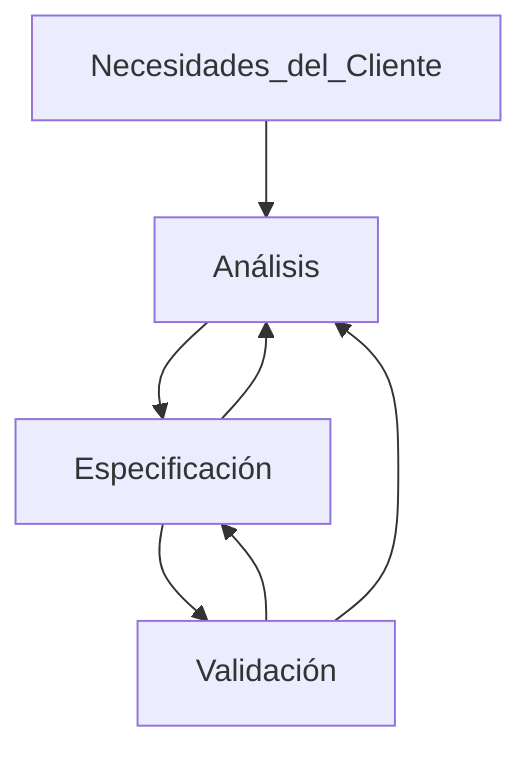

---
## Introducción

El software => Colección de programas, procedimientos, documentación y datos asociados que determinan la operación de un sistema de computación  

Las fallas de software siempre estuvieron presentes desde su desarrollo. No así las fallas mecánicas o eléctricas que son por el deterioro del tiempo. Es decir que la falla de software estuvo presente desde el principio, solo que nunca se había manifestado

El mantenimiento del software suele costar mas que el desarrollo y su motivo es para:
- Corregir errores residuales (Updates) => Mantenimiento Correctivo
- Mejorar funcionalmente el software y adaptarlo a los cambios del entorno (Upgrades) => Mantenimiento Adaptativo

La *Ingeniería del Software* es una aplicación de un enfoque sistemático, disciplinado y cuantificable al desarrollo, operación y mantenimiento del software
Un **Enfoque Sistemático** es una metodología y practicas existentes para solucionar un problema dentro de un dominio determinado. De esta forma podemos repetir dicho procedimiento y estimar los resultados

#### Enfoque

El enfoque de la *Ingeniería del Software* viene del problema de producir un software determinado por la idea de satisfacer las necesidades del cliente. El objetivo básico de la *IS* es buscar el **CYP**(calidad y productividad), los cuales están rodeados del triangulo de hierro formado por la tecnología, la gente y el proceso. Pero tenemos otros factores que también modifican este enfoque:
1. Escala
2. Calidad
3. Productividad
4. Consistencia
5. Cambios

#### Escala
La *Ingeniería del software* debe tener en cuenta la escala del software a desarrollar, ya que no siempre los métodos para solucionar pequeños problemas funcionan con problemas de mayor magnitud. Por ende, estos métodos deben tener la capacidad de adaptación y respuesta del mismo a medida que aumenta la cantidad de usuarios o requerimientos al mismo. Para ello hay 2 claras dimensiones a considerar:
- Métodos de Ingeniería
- Administración del Proyecto
Los cuales en sistemas pequeños ambos pueden ser informales, pero al tratarse de un sistema grande, ambos deben ser formales 

**¿Qué es un sistema grande o chico?**

| Pequeño   | Mediano         | Grande            | Muy Grande  |
| --------- | --------------- | ----------------- | ----------- |
| < 10 KLOC | < 10 a 100 KLOC | < 100 a 1000 KLOC | > 1000 KLOC |

#### Productividad
Un software que demora mucho tiempo en ser entregada o uno barato y de mala calidad son inaceptables. El costo del software se mide en Persona/Mes. La productividad asocia estas 2 ideas de forma tal que $\text{Si es mas alta} => \text{menor costo}/\text{Menor Tiempo}$ (aunque también dependa de la cantidad de personas)

#### Calidad
Claramente desarrollar software de alta calidad es otra motivación de la *Ingeniería del Software*, aunque la calidad de un software es difícil de definir. Su definición estándar se basa en 6 aspectos:
1. Funcionalidad: Capacidad de proveer funciones que cumplen las necesidades establecidas
2. Confiabilidad: Capacidad de realizar las funciones necesitadas en un tiempo determinado 
3. Usabilidad: Capacidad de ser comprendido, aprendido y usado
4. Eficiencia: Capacidad de proveer desempeño apropiado en base a la cantidad  de recursos usados 
5. Mantenibilidad: Capacidad de ser modificado con el propósito de corregir, mejorar o adaptar
6. Potabilidad: Capacidad de ser adaptado a otro entorno sin necesidad de realizar muchos cambios

Este concepto de realidad tiene muchas dimensiones como para reducirlo a un solo número, por ello en cada proyecto se elige que será calidad para este, enfocándose en uno de los aspectos anteriores como principal. Normalmente se elige Confiabilidad. Se tienen 2 formas de medir la Confiabilidad
1. $\text{+fallas} = -\text{confiable}$
2. $\text{Calidad} = \text{Cantidad de defectos en software}/\text{tamaño}$

Normalmente el calculo seria  < 1 defecto /KLOC
x
#### Consistencia y repetitividad
Algunas veces un grupo puede desarrollar un software de buena calidad. Un objetivo clave de la *Ingeniería del software* es la sucesiva producción de sistemas de alta calidad y con alta productividad. Esta consistencia es la que nos permite predecir el resultado del proyecto con certeza razonable. Sin esta consistencia seria imposible estimar costos 

#### Cambios
El software debe cambiar para adaptarse a los cambios de la institución/empresa. Las practicas de la *IS* deben preparar al software para que estos cambios no sean abruptos, es decir que este sea fácilmente modificable. Los métodos que producen alta calidad, si no permiten cambios, no son útiles

La *IS* se enfoca mayormente en el proceso para conseguir los objetivos de calidad y productividad, siendo el **enfoque sistemático** el proceso que se utiliza.
La *IS* separa el proceso para desarrollar software del producto en si desarrollado. El proceso es quien determina en gran medida la **CYP**. Diseñar el proceso apropiado y su control es el desafió clave de la *IS*

#### El proceso de desarrollo en fases
El proceso de desarrollo consiste en varias fases, las cuales tienen una salida definida. Estas fases se realizan en el orden especificado por el modelo de procesos que se elija seguir. EL motivo de separar el desarrollo en fases es la *separación de incumbencias*: donde cada fase manipula distintos aspectos del desarrollo de software. Además cada fase permite verificar la calidad y el progreso al terminar. Este enfoque de desarrollo en fases es central en el enfoque de la *IS* para solucionar la crisis de software

Estas fases en general son:
1. Análisis y especificación de los requerimientos
2. Arquitectura
3. Diseño
4. Codificación
5. Testing
6. Entrega y instalación 

Los enfoques sistemáticos necesitan que cada etapa se realice de forma rigurosa y formalmente

#### Administración del Proceso 
La administración del proceso establece cómo asignar los recursos a las distintas tareas, cómo organizarlas temporalmente, cómo asegurar que cada fase se desarrollo apropiadamente,etc. Sin la administración del proceso es virtualmente imposible cumplir con los objetivos de **CYP**. El planeamiento del proyecto es central en la administración del proyecto para poder determinar cuestiones como:
- ¿El proyecto se está desarrollando a término?
- ¿El proyecto procede acorde al presupuesto?
- ¿Se esta cumpliendo con los objetivos de calidad?
Las cuales son importantes para poder planear y administrar las métricas y medidas 

## Análisis y especificación de los requerimientos

En problemas pequeños es mas fácil comprender y especificar los requerimientos, en problemas grandes, en cambio, es mas difícil ya que hay grandes posibilidades de cometer un error

*Identificar y especificar* los requisitos necesariamente involucra interacción con la gente, no puede automatizarse. La fase de requisitos termina produciendo un documento con la especificación de los requerimientos del software(**SRS**). Es decir que esta **SRS** especifica lo que el sistema propuesto debe hacer 

##### ¿Pero, por que es tan importante la SRS?

La *SRS* establece las bases para el acuerdo entre el cliente/usuario y el desarrollador. En esta tenemos 3 partes involucradas:
- Cliente => Tiene necesidades
- Usuario => Tiene consideraciones 
- Desarrollador  => Debe entender lo que intentan comunicar el cliente y el usuario

Normalmente hay una brecha comunicacional entre estas partes ya que el:
- Cliente: No comprende el proceso de desarrollo de software
- Desarrollador: NO conoce el problema del cliente ni su área de aplicación 

La SRS es el medio para reconciliar las diferencias y especificar las necesidades del
cliente/usuario de manera que todos entiendan.

>[!INFO]- *Requerimiento* 
>- Una condición o capacidad necesaria de un usuario para solucionar un problema o alcanzar objetivos
>- Una condición o capacidad que debe poseer o cumplir un sistema

Estos requerimientos son difíciles de entender/discernir ya que visualizar el futuro sistema es complicado, al igual que visualizar sus capacidades. Además estos requerimientos cambian con el tiempo, por lo cual es muy importante realizar correctamente la SRS 

Principalmente por las siguientes 5 razones:
1. Ayuda al usuario a comprender sus necesidades
2. Los usuarios no siempre saben lo que quieren o necesitan. Deben analizar y comprender el potencial del sistema
3. El proceso de requerimientos ayuda a aclarar las necesidades 
4. La SRS provee una referencia para la validación del producto final
5. Debería dar una clara comprensión de lo que se espera

>[!attention] Una SRS de alta calidad es esencial para obtener software de alta calidad

Los errores de requerimiento sólo se manifiestan en el software final. Para satisfacer los objetivos de calidad, se debe comenzar con una SRS de calidad 

Una buena SRS reduce los costos de desarrollo ya que a medida que avanza el proyecto, corregir los errores en la SRS es mas caro llegando a costar hasta un %40.

|            Phase            | Cost(person/hours) |
| :-------------------------: | :----------------: |
|       Requerimientos        |         2          |
|           Diseño            |         5          |
|        Codificación         |         15         |
|           Testing           |         50         |
| Instalación y mantenimiento |        150         |

#### Proceso de Requerimientos
*Proceso de Requerimientos* => Secuencia de pasos que se realizan para convertir las necesidades del usuario en una SRS. Este proceso debe recolectar las necesidades y los requerimientos y especificarlos claramente. Se puede dividir en 3 actividades:
1. ==Análisis del problema o requerimientos== => Más difícil ya que exige la recolección y extracción de estos
2. Especificación de los requerimientos
3. Validación 

Este proceso no es lineal, es iterativo y en paralelo. Hay superposición entre las fases (algunos requerimientos pueden estar siendo especificados mientras otros son analizados). Muchas veces especificar un requerimiento ayuda a su análisis; mientras que la validación puede mostrar brechas entre el análisis y su especificación 

La transición del análisis a la especificación es complicada. La especificación se enfoca en el comportamiento externo, mientras que el análisis tiene como objetivo comprender la estructura del problema y su dominio, sus componentes, entradas y salidas; además que en esta se recolecta mas información de la necesaria para la especificación 

El uso del análisis y las estructuras que lo construyen puede ser indirecto, ayudando a comprender en lugar de asistir a la especificación 

#### Análisis de los requerimientos 
El análisis se enfoca en la comprensión del sistema deseado y sus requerimientos. Normalmente se aplica un *Divide y vencerás*, es decir se divide el problema en partes mas pequeñas y se intenta comprender estas mini partecitas y su relación entre ellas
Normalmente se generan grandes cantidades de información, la cual debe ser organizada para su entendimiento; para ello se suelen usar métodos como diagrama de flujo de datos, diagrama de objetos, etc.

El análisis incluye: 
- Entrevistas con clientes y usuarios 
- Lecturas de manuales 
- Estudio del sistema actual
- Ayudar al cliente/usuario a comprender nuevas posibilidades 

El analista no solo se encarga de recolectar información, sino también como consultor. Debe tener muy buenas habilidades  comunicativas para construir relaciones interpersonales.  Otras cuestiones importantes que debe hacer el analista :
- Obtener la información necesaria 
- Brainstorming: Interactuar con el cliente para establecer las propiedades deseadas 
- Organizar información dado que recolecta gran cantidad de esta 
- Asegurar completitud
- Asegurar consistencia 
- Evitar diseño interno 

Hay 3 enfoques/métodos para analizar los subproblemas y sus relaciones:
1. Funciones: análisis estructural
2. Objetos: análisis orientado a objetos 
3. Eventos del sistema: particionado en eventos

###### Enfoque Informal 
Además se nos presenta el *Enfoque informal* en el cual no hay una metodología definida, la información se obtiene mediante el análisis, el dialogo, la observación, etc y se plasma y organiza en la *SRS* sin formalidades. Puede ser útil en muchos casos pero se sostiene completamente en la experiencia del analista y el feedback provisto por el cliente 

###### Modelado de flujo de datos 

- Es ampliamente utilizado
- Se centra en las funcionalidades del sistema, no en lo que no hace
- Ve al sistema como una red de transformadores de datos
- Para el modelado se utilizan diagramas de flujo de datos

Un *DFD* o diagrama de flujo de datos es una representación grafica del flujo de datos atraves de un sistema, es un gráfico lógico del plan de trabajo que se ejecutará para la solución de un determinado problema. Se enfoca en que hacen los transformadores y no en como lo hacen, por lo que normalmente se muestran las entradas y salidas mas importante, obviando algunas. No hay loops ya que no presenta la noción de control de flujo de datos, no hay *IF's* por ejemplo.

Estos *DFD* presentan un diccionario de datos, el cual es simplemente una forma de describir mas detalladamente los datos que fluyen entre los transformadores, en estos se pueden usar expresiones regulares  

Los pasos del **Método de análisis estructurado** son:
1. Dibujar el diagrama del contexto
2. Dibujar el DFD del sistema existente
3. Dibujar el DFD del sistema propuesto e identificar la frontera hombre-máquina

###### Modelado Orientado a objetos 
Ventajas:
- Mas fácil de hacer y entender 
- La transición del análisis orientado a objetos al diseño orientado a objetos parece ser mas simple
- Es mas resistente/adaptable a cambios ya que los objetos son mas estables que las funciones 

En este método el sistema es visto como un conjunto de objetos interactuando entre si, o con el usuario a través de servicios(métodos) que cada objeto provee. Lo que buscamos es:
1. Identificar las clases del dominio 
2. Definir dichas clases identificando sus atributos y métodos
3. Identificar las relaciones entre dichas clases sea a través de jerarquías o de los métodos

###### Prototipado 

Se construye un sistema parcial prototípico. Lo desarrolladores, clientes y usuarios lo utilizan para comprender mejor el problema y las necesidades sirviendo de ayuda visual al sistema final. Este prototipo puede ser descartable o evolutivo, siendo el primero de estos el mas utilizado 

#### Especificación de los requerimientos 

Al terminar la etapa de especificación nuestra salida es la *SRS*, construida en base al conocimiento adquirido durante la etapa de Análisis pero enfocado en el comportamiento externo del sistema . Cabe aclarar que la *SRS* no es una formalización del modelo anterior, sino que se construye en base a este. 

**Características de una SRS:**
- Correcta
	- Cada requerimiento representa precisamente alguna característica deseada por el cliente en el sistema final.
- Completa
	- Todas las características deseadas por el cliente están descriptas. La característica más difícil de lograr, para conseguirla uno debe detectar las ausencias en la especificación. Corrección y completitud están fuertemente relacionadas.
- No ambigua 
	- Si para cada requerimiento existe un solo significado. Si es ambigua los errores se colarán fácilmente. La no ambigüedad es esencial para verificabilidad. Como la verificación es usualmente hecha a través de revisiones, la SRS debe ser comprensible, al menos por el desarrollador, el usuario y el cliente. Particular atención si se usa lenguaje natural. Los lenguajes formales ayudan a “desambiguar”.
- Consistente
	- Ningún requerimiento contradice a otro
- Verificable 
	- Si existe para cada requerimiento algún proceso efectivo que puede asegurar que el software final satisface el requerimiento.
- Rastreable
	- Se debe poder determinar el origen de cada requerimiento y cómo éste se relaciona a los elementos del software. Hacia adelante: dado un requerimiento se debe poder detectar en qué elementos de diseño o código tiene impacto. Hacia atrás: dado un elemento de diseño o código se debe poder rastrear que requerimientos está atendiendo.
- Modificable
	- Si la estructura y estilo de la SRS es tal que permite incorporar cambios fácilmente preservando completitud y consistencia. La redundancia es un gran estorbo para modificabilidad, puede resultar en inconsistencia.
- Ordenada en aspectos de importancia y estabilidad
	- Los requerimientos pueden ser críticos, importantes pero no críticos, deseables pero no importantes. Algunos requerimientos son esenciales y difícilmente cambien con el tiempo. Otros son propensos a cambiar. => Se necesita definir un orden de prioridades en la construcción para reducir riesgos debido a cambios de requerimientos

**¿Que debe tener una SRS?**
- Requerimientos de Funcionalidad
- Requerimientos de desempeño
- Restricciones de diseño
- Requerimientos de interfaces externas
###### Requerimientos de Funcionalidad
Es el corazón de la *SRS*, conforma la mayor parte de la especificación. Especifica toda las funcionalidades que el sistema debe proveer. Las salidas que se deben producir para cada entrada dada y las relaciones entre ellas. También describe todas las operaciones que el sistema debe realizar, las entradas validas y las verificaciones de validez para entrada y salida. Y especifica el comportamiento del sistema en caso de entradas invalidas, errores de calculo, es decir de situaciones anormales o situaciones normales con imposibilidades de seguir operando por x razón 
###### Requerimientos de desempeño
Se dividen en *Requerimientos dinámicos* los cuales especifican restricciones sobre la ejecución como:
- Tiempo de respuesta
- Tasa de transferencia o rendimiento
- etc.
En general se especifican los rangos aceptables de distintos parámetros, en casos normales y extremos

Y en los *Requerimientos estáticos* o de capacidad los cuales no imponen restricción en la ejecución como:
- Cantidad de terminales admitidas
- Cantidad de usuarios en simultaneo
- Etc.
Todos estos requisitos se especifican en términos medibles para ser verificados 

###### Restricciones de diseño
Existen factores en el entorno del cliente que pueden restringir las elecciones de diseño como limitaciones de hardware por ejemplo. 
###### Restricciones de interfaces externas 
Todas las interacciones del software con gente, hardware, y otro software debe especificarse claramente. Cabe recalcar que la interfaz del usuario debe recibir atención adecuada creando un manual preliminar indicando los comandos del usuario, los formatos de las pantallas, etc. Estos requerimientos también deben ser precisos para asegurar la verificabilidad.

###### Lenguajes de especificación 

Los lenguajes de especificación deben facilitar la escritura y entendimiento de la *SRS*, a la vez de ser fáciles de aprender. Normalmente se utiliza el lenguaje natura apoyado en documentos estructurados para reducir imprecisiones y ambigüedades, ya que este mismo, si bien es entendido por el cliente como por el desarrollador, puede ser muy ambiguo. Las notaciones formales se utilizan en propiedades especificas del sistema o en sistemas críticos 

###### Casos de Uso 

Un caso de uso captura un contrato entre el usuario y el comportamiento del sistema como *interacción*. Útil en la recolección de requerimientos ya que a los usuarios les agrada, comprenden el formato y reaccionan a este fácilmente. Son colecciones de muchos escenarios donde estos escenarios pueden llamar a otros casos de uso, organizando así jerárquicamente los casos de uso. Los casos de uso solo forman la parte funcional de la *SRS*
**Conceptos Básicos:** 
- Actor: Una persona o sistema diferente que interactúan con el sistema propuesto para alcanzar un objetivo. Los actores son entidades lógicas, por lo cual un actor transmisor y uno receptor son diferentes, aun si hacen referencia al mismo individuo
	- Actor primario: Es quien inicia el Caso de Uso, y este debe satisfacer su objetivo
	- Actor secundario: Es alguien que puede realizar la ejecución real en vez del actor primario, pero no tiene relación directa con el objetivo del caso de uso
- Escenario: Es un conjunto de acciones realizadas con el fin de alcanzar un objetivo bajo determinadas condiciones. Un paso es una acción lógicamente completa realizada tanto por el actor como por el sistema (Es una interacción entre el usuario y el sistema)
	- Escenario exitoso principal:  cuando todo funciona correctamente y se alcanza el objetivo
	- Escenario alternativo/excepcional: Cuando algo sale mal y el objetivo no puede ser alcanzado 

**Elaboración de casos de uso:**
1. Actores y objetivos:
	- Preparar una lista de actores y objetivos
	- proveer un breve resumen de cada caso
2. Escenarios exitosos principales:
	- Por cada cado de uso extender el escenario principal, proveyendo el comportamiento principal del sistema con este (puede revisarse para ver que satisface el interés de los participantes y actores)
3. Condiciones de falla:
	- Identificar y listar condiciones de falla para cada caso de uso
4. Manipulación de Fallas (maybe lo mas dificil):
	- Especificar el comportamiento del sistema para cada condición de falla

**Errores comunes:**
- Debe haber *interacción* entre los escenarios exitosos (Entre cada paso)
- Un caso de uso nunca puede ser iniciado por el sistema
- Los escenario excepcionales siempre deben hacer referencia a un punto del exitoso donde el sistema chequea algo 
- Las precondiciones de casos generales deben implicar las de los casos que se referencias adentro
- Seguir sintaxis dada en clase
- No hay lógica de programación (If's, loops, etc.)

###### Validación de requerimientos

Debido a la misma naturaleza de esta etapa, hay muchas posibilidades de malentendidos. Mientras mas se avanza en el desarrollo mas caro es corregir y encontrar dichos errores, por lo cual arreglarlos en esta etapa es crucial 
La *SRS* se revisa por un grupo de personas conformado por: autor, cliente, representantes de usuarios y de desarrolladores, donde deben estar los *clientes* y *usuarios*.
Existen herramientas para el modelado y análisis de especificaciones 

###### Métricas

Para poder estimar costos y tiempos y  planear el proyecto se necesita "medir" el esfuerzo que demandará. Este depende de muchos factores; principalmente el *tamaño*. Al principio el tamaño solo puede ser estimado. 
Una métrica es importante sólo si es útil para el seguimiento o control de costos, calendario o calidad. Por ende necesitamos una unidad de tamaño que se pueda computar a partir de los requerimientos: ¿El tamaño de la SRS?, no, ya que depende mucho del autor. 

Por lo cual se utiliza: **Punto Función**, siendo una estimación similar a la métrica por LOC que se determina sólo con la SRS definiendo el tamaño en términos de la "Funcionalidad":
- Entradas externas a la aplicación
- Salidas externas que deja el sistema
- Archivos lógicos internos
- Archivos de interfaz externa 
- Transacciones externas 

|    ==Tipo de Funciones==     | ==Simp== | ==Prom.== | ==Comp-== |
| :--------------------------: | :------: | :-------: | :-------: |
|      Entradas Externas       |    3     |     4     |     6     |
|       Salidas externas       |    4     |     5     |     7     |
|  Archivos lógicos internos   |    7     |    10     |    15     |
| Archivos de interfaz externa |    5     |     7     |    10     |
|    Transacciones externas    |    3     |     4     |     6     |

Debemos contar cada tipo de función diferenciando según sea compleja, promedio o simple teniendo en cuanta que $C_{ij}$ denota la cantidad de funciones tipo $i$ con complejidad $j$ en la formula de Punto función no ajustado (UFP):$$\sum^5_{i=1}{\sum^3_{j=1}w_{ij}C_{ij}}$$
Luego debemos ajustar UFP de acuerdo a la complejidad del entorno. Se evalúa según las siguientes características:
1. comunicación de datos 
2. procesamiento distribuido 
3. objetivos de desempeño 
4. carga en la configuración de operación 
5. tasa de transacción 
6. ingreso de datos online 
7. eficiencia del usuario final 
8. actualización online 
9. complejidad del procesamiento lógico 
10. reusabilidad 
11. facilidad para la instalación 
12. facilidad para la operación 
13. múltiples sitios 
14. intención de facilitar cambios

El factor de ajuste de complejidad (CAF) se calcula como $$0.65+0.01*\sum^{14}_{i=1}{p_i}$$
Y los Puntos función = CAF * UFP

Hay que recalcar que la calidad de la *SRS* tiene impacto directo en los costos del proyecto. Por lo cual tener buenas métricas para evaluar es algo necesario. Existen:
- Métricas de *calidad directa*: Evalúan la calidad del documento estimando el valor de los atributos de calidad de la *SRS*
- Métricas de *calidad indirecta*: Evalúan la efectividad de las métricas del control de calidad usadas en el proceso en la fase de requerimientos

## Arquitectura del Software 

La *Arquitectura del software* de un sistema es la estructura del sistema que comprende los elementos del software, las *propiedades externamente visibles* de tales elementos y la relación entre ellas. Por cada elemento sólo interesan las propiedades externas necesarias para especificar las relaciones, **no** son importantes los detalles de cómo se aseguran dichas propiedades. En general en un sistema se tienen varias estructuras que coinciden en algún punto. Una descripción arquitectónica del sistema describe distintas estructuras del sistema

La *arquitectura* es el diseño del mas alto nivel, donde se hacen las elecciones de tecnología, productos a utilizar, servidores, etc. Divide al sistema en partes lógicas tal que cada una puede ser **comprendida independientemente**, describiendo también la relación entre ellas. Hay muchas estructuras diferentes que proveen diferente visión del sistema

La arquitectura del software ayuda muchísimo a:
- Comprensión y comunicación: Al mostrar la estructura de alto nivel del sistema ocultando su complejidad, facilita la comunicación definiendo un marco de comprensión común entre los interesados siendo de mucha ayuda para las negociaciones, acuerdos y comprensión del sistema existente
- Reúso: Una forma de reúso es componer el sistema con partes existentes, lo cual se facilita si a un alto nivel se reúsan componentes que proveen un servicio completo. Por lo cual se elige una arquitectura tal que las *componentes existentes encajen* adecuadamente con otras componentes a desarrollar. Estas decisiones sobre el uso de componente se toman en el momento de diseñar la arquitectura 
- Construcción y evolución: La división provista por la arquitectura servirá para *guiar* el desarrollo del sistema. Ayuda a asignar equipos de trabajos a diferentes partes independientes, además de facilitar la elección de cuáles partes necesitas cambiarse durante la evolución del software contribuyendo a decidir cuál es el impacto de dichos cambios
- Análisis: Es deseable que propiedades de *confiabilidad y desempeño* puedan determinarse en el diseño de alto nivel, permitiendo considerar distintas alternativas de diseño hasta encontrar los niveles de satisfacción deseados. Lo cual requerirá descripción precisa de la arquitectura así como de las propiedades de las componentes 

###### Vistas de la Arquitectura

Una vista consiste de elementos y relaciones entre ellos, describiendo una estructura. Los elementos de dicha vista dependen de lo que la vista quiera destacar, por lo que distintas vistas exponen diferentes propiedades. Logrando reducir la complejidad con la que debe encontrarse el lector 
**Tipos de vista:**
- Módulo  =>  Los elementos son módulos, es decir, no representan unidades en ejecución (ej: clases, paquetes, métodos) y la relación entre ellos está basada en el código(ej: "parte de", "usa a")
- Componentes y conectores => Los elementos son entidades de ejecución denominados componentes(objetos, procesos, etc.), y sus conectores proveen el medio de interacción entre as componentes 
- Asignación de Recursos => Se enfoca en cómo las unidades de software se asignan a recursos. Exponen propiedades estructurales como qué proceso ejecuta en qué procesador, qué archivo reside donde, etc. 

![[Pasted image 20250914172743.png]]

Una descripción arquitectónica consiste de vistas de distintos tipos, cada una mostrando una estructura diferente. Normalmente la vista de Componentes y Conectores es la principal

###### Vista de Componentes y Conectores

Tiene 2 elementos principales, los componentes y los conectores. Esta vista describe qué componentes existen y como interactúan entre ellos en ==tiempo de ejecución==. Prácticamente es un grafo donde los componentes son nodos y los conectores aristas

**Componentes:** Son unidades de cómputo o de almacenamiento de datos, cada componente tiene un nombre y tipo
**Conectores:** Describen el *medio* en el cual la interacción entre componentes toma lugar- Estos tienen nombre y tipo. Muchas veces estos conectores representan protocolos

###### Estilos Arquitectónicos

Sistemas distintos tienen estructuras CyC(Componentes y conectores) distintas, algunas estructuras son generales y son útiles para una clase de problemas, estos son llamados estilos arquitectónicos. Un estilo arquitectónico define una familia de arquitecturas que satisface restricciones de ese estilo. Distintos estilos pueden fusionarse para generar una nueva arquitectura 

**Tubos y Filtros:** Adecuado para sistemas que fundamentalmente realizan *transformaciones de datos*. Un sistema que utiliza este estilo usa una red de transformadores para realizar el resultado deseado. Esta compuesto por un solo tipo de componente: filtro y un solo tipo de conector : tubo. Un filtro realiza transformaciones y le pasa los datos a otro filtro por un tubo 
**Restricciones:**
- Un filtro es una entidad independiente y asincrónica
- Un filtro no necesita saber la identidad de los filtros que envían o reciben datos
- Un tubo es un canal de redirección unidireccional que transporta un flujo de un filtro a otro
- Un tubo sólo conecta 2 componentes
- Lo filtros deben hacer "buffering" y sincronización para asegurar el correcto funcionamiento como productor y consumidor 
- Cada filtro debe trabajar sin conocer la identidad de los filtros productores o consumidores 
- Un tubo debe conectar un puerto de salida de un filtro a un puerto de entrada de otro filtro
- Un sistema *puro* de tubos y filtros usualmente requiere que cada filtro tenga su propio hilo de control
![[Pasted image 20250915091124.png]]

**Estilo de datos compartidos:** Hay 2 tipos de componentes, el repositorio de datos y usuario de datos. El primero provee almacenamiento permanente confiable, mientras que los usuarios acceden a los datos en el repositorio, realizan cálculos y luego ponen esos datos en el repositorio. De esta forma solo hay 1 tipo de conector de lectura/escritura. Tiene 2 variantes, el *estilo pizarra* donde cuando hay un cambio en el repositorio se les notifica a todos los usuarios de dicho repositorio, y el *estilo repositorio* donde el repositorio es pasivo

![[Pasted image 20250915091107.png]]

**Estilo cliente servidor:** Hay 2 tipos de componentes, los clientes y los servidores, donde los primeros solo se comunican con el servidor de forma asincrónica, ya que también son los clientes quienes deben iniciar dicha comunicación. El único tipo de conector que hay es request/reply. Normalmente este estilo tiene una estructura multi-nivel

![[Pasted image 20250915091050.png]]
**Otros estilos:**
	- *Estilo publicar-suscribir:* hay 2 tipos de componentes, los publicadores y las que se suscriben a eventos de modo que cada vez que se publica algo, se invoca a las componentes suscriptas 
	- *Estilo peer to peer:* Un único tipo de componente donde cada uno puede pedirle servicios a otro
	- *Estilo de procesos que se comunican :* Procesos que se comunican entre si

###### Documentación del diseño arquitectónico

Si bien los diagramas son un medio adecuado para discutir y crear diseños, no son suficientes para documentarlo. Por eso existe el *Documento arquitectónico*, el cual debe especificar precisamente las vistas y las relaciones entre éstas. Se organiza de la siguiente manera:
1. Contexto del sistema y la arquitectura
2. Descripción de las vistas de la arquitectura 
	1. Presentación principal de la vista
	2. Catálogo de elementos
	3. Fundamento de la arquitectura 
	4. Comportamiento
	5. Otra información 
3. Documentación transversal a las vistas

###### Arquitectura VS Diseño 

Tanto la arquitectura como el diseño dividen el problema en partes y dicen como éstas se organizan. Aunque la arquitectura *ES* un diseño de muy alto nivel que se enfoca en las componentes principales encontrándose en el dominio de la solución y no en el dominio del problema. Ambos definen donde acaba una tarea y empieza otra, pero la arquitectura no considera la estructura interna y solo se enfoca en identificar las partes necesarias para evaluar propiedades deseadas

###### Preservación de la integridad de la arquitectura

Si bien muchos diseñadores/desarrolladores solo usan la arquitectura para comprender el sistema, esta impone restricciones que deben preservarse inclusive en la implementación. Para que la arquitectura tenga sentido ésta debe acompañar el diseño y el desarrollo del sistema, por mas fácil que sea ignorarla

###### Evaluación de las Arquitecturas

Como la arquitectura tiene *impacto* sobre los *atributos no funcionales* (como modificabilidad, desempeño, confiabilidad, portabilidad, etc.) debe ser evaluada con respecto a estas propiedades en la arquitectura propuesta . Si bien podría hacerse con técnicas formales, vamos a estudiar el método **ATAM**(Architecture Tradeoff Analysis Method)

El **ATAM** evalúa las consecuencias de las decisiones arquitectónicas en relación a los atributos de calidad. Sus principales pasos son:
1. *Recolectar escenarios:*
	- Los escenarios describen interacciones del sistema
	- Elegir los escenarios de interés para el análisis
	- Incluir escenario excepcionales sólo si son importantes 
2. *Recolectar requerimientos y/o restricciones:* 
	- Definir lo que se espera del sistema en tales escenarios
	- Deben especificar los niveles deseados para los atributos de interés
3. *Describir las vistas arquitectónicas:*
	- Las vistas del sistema que serán evaluadas son recolectadas
	- Distintas vistas pueden ser necesarias para distintos análisis 
4. *Análisis especifico a cada atributo:*
	- Se analizan vistas bajo distintos escenarios separadamente para cada atributo de interés distinto
	- Esto para comparar los niveles deseados con los obtenidos con cada atributo
5. *Identificar puntos sensitivos y de compromisos:*
	- Análisis de sensibilidad: ver el impacto de un elemento sobre un atributo de calidad, los que mas afectan los atributos son los puntos de sensibilidad
	- Análisis de compromiso: Los puntos de compromiso son los elementos que son puntos de sensibilidad para varios atributos

## Modelos de Proceso de Desarrollo

Un **Modelo de proceso** especifica un proceso general, usualmente como un conjunto de etapas adecuado para una clase de proyectos, es decir, provee una estructura genérica de los procesos que pueden seguirse en algunos proyectos con el fin de alcanzar sus objetivos 

Normalmente si se elige un modelo para un proyecto, es necesario adecuarlo al proyecto en si, especificando el proceso del proyecto. De esta forma tenemos:

 - **Modelo de proceso:** especificación genérica del proceso
 - **Especificación del proceso:** plan de lo que debe ejecutarse 
 - **Proceso:** lo que realmente se ejecuta 

Los modelos mas comunes son 
1. **Cascada**(el mas viejo, bastante usado)
2. **Prototipado**
3. **Iterativo**(ampliamente usado en la actualidad)
4. **Timeboxing**

###### Cascada

Tiene 6 faces muy parecidas a las vistas anteriormente:
1. Análisis de requerimientos
2. Diseño de alto nivel
3. Diseño detallado
4. Codificación
5. Testing
6. Instalación
Una fase comienza sólo cuando la anterior finaliza, en principio no hay feedback con el cliente ni con otras fases(existe el modelo de cascada con feedback, pero este solo permite el feedback a fases con distancia de uno, es decir, solo con la fase anterior). Normalmente se hace un testing de cada fase antes de pasar a la siguiente para ver que todo ande bien

**Ventajas:**
- Conceptualmente simple: divide el problema en fases que se pueden realizar independientemente 
- Enfoque natural a la solución de problemas (intuitivo y lógico)
- Fácil de administrar y ejecutar en un contexto contractual: existen fronteras bien definidas entre cada fase
**Uso:**
- Muy adecuado para proyectos donde los requerimiento son bien comprendidos y las decisiones sobre tecnología son tempranas
- Es adecuado para proyectos donde los desarrolladores están muy familiarizados con el problema a solucionar y el proceso a seguir 
- Proyectos de corta duración
- Automatización de procesos manuales existentes 

**Debilidades:**
- Todo o nada: muy riesgoso 
- Los requisitos se congelan muy temprano(no hay feedback con cliente)
- Puede escoger hardware de tecnologías viejas
- No permite cambios
- No hay Feedback con el usuario

![[Pasted image 20250915095850.png]]

###### Prototipo

El prototipo intenta abordar las debilidades de cascada en la especificación de los requerimientos de forma que en vez de construir los requerimiento sólo basado en charlas y debates, se construye un prototipo que permita comprender los requerimientos. Así el cliente tiene mas idea de lo que sería el Software obteniendo mejor feedback de él disminuyendo los riesgos de requerimientos. *La etapa de análisis de requerimientos es remplazada por una "mini cascada"*

El prototipo solo incluye características que necesitan mejor comprensión o no fueron entendidas correctamente. Luego el cliente "juega" con el prototipo y provee feedback, este proceso se repite hasta que el costo supere el beneficio del proceso. **El prototipo debe descartarse**. El costo del prototipo debe mantenerse bajo:
- Construir sólo aspectos que se necesiten aclarar
- "Quick and Dirty": no importa la calidad
- Omitir manejo de excepciones
- Reducir testing

**Ventajas:**
- Mayor estabilidad en los requerimientos 
- Los requerimientos se congelan mas tarde
- La experiencia en la construcción del prototipo ayuda al desarrollo principal
- Sistemas finales mejores y más estables 

**Desventajas:**
- Potencial impacto en costo y tiempo
- No permite cambios tardíos
- Comienzo pesado 

**Aplicación:**
- Cuando los requerimientos son difíciles de determinar y la confianza en ellos es baja
- Sistemas con usuarios novatos 
- Cuando las interfaces con el usuario no son muy importantes 

![[Pasted image 20250915095907.png]]

###### Iterativo

Logra abordar el problema del "todo o nada" del modelo de cascada combinando beneficios del Prototipado y del Cascada desarrollando el software incrementalmente, donde cada incremento es completo en si mismo testeando luego de cada uno. Puede verse como una *secuencia de cascadas*. El feedback de una iteración se puede usar en iteraciones futuras

Primero se crea la **Lista de control del proyecto(LCP)** la cual contiene en orden las tareas que se deben realizar para lograr la implementación final. Cada iteración consiste en eliminar la siguiente tarea de la lista haciendo *diseño, implementación y análisis* del sistema parcial y actualizar la **LCP**, repitiendo este proceso hasta vaciar la lista 

**Ventajas:**
- Pagos y entregas incrementales
- Feedback para mejorar desarrollo entre iteraciones 
- Entregas regulares y rápidas
- Reduce riesgo
- Prioriza requisitos y acepta cambios 

**Desventajas:**
- La Arquitectura y el diseño se ven perjudicados 
- La revisión del trabajo hecho puede incrementarse 
- El costo total suele ser mayor 
- Sobrecarga de planeamiento en cada iteración
- El trabajo de una iteración puede deshacerse en otra

**Aplicación:**
- Cuando el tiempo de respuesta es importante
- Cuando no se puede tomar el riesgo de proyectos largos
- Cuando no se conocen todos los requerimientos 

![[Pasted image 20250915101210.png]]

###### Timeboxing 

Timeboxing primero fija la duración de las iteraciones y luego determina la especificación, dividiendo la iteración en partes iguales usando pipelining para ejecutar iteraciones en paralelo  

El desarrollo se realiza iterativamente en "cajas temporizadas" de igual duración, cada una de estas se divide en etapas de duración fijas desarrollando una tarea bien definida independiente a las demás. Hay un equipo en cada etapa. El cronograma tiene un alto compromiso con este modelo

**Ventajas:**
- Todas las del iterativo
- Menor tiempo de entrega
- Ejecución del proyecto distribuida
- Planeamiento y negociación un poco más fácil

**Desventajas:**
- Grandes equipos de trabajo
- Administración de proyecto mucho mas compleja 
- Se necesita mucha sincronización
- Es posible el incremento de los costos

**Aplicación:**
- Cuando los tiempos de entrega son muy importantes
- Hay flexibilidad en agrupar características 

![[Pasted image 20250915101719.png]]

## Diseño del Software

Esta etapa comienza una vez los requerimientos están definidos pero se realiza antes de la implementación. El resultado del diseño se utilizara para implementar el sistema 

El diseño es una actividad *creativa*, su objetivo es crear un "plano del sistema" que satisfaga los requerimientos. Tiene un gran impacto en el testing y mantenimiento 

Tiene 3 niveles:
- **Diseño arquitectónico:** Identifica los componentes necesarios del sistema, su comportamiento y relaciones 
- **Diseño de alto nivel:** es la vista de módulos del sistema, es decir, cuales son los módulos del sistema, que hacen y como se organizan 
- **Diseño detallado o diseño lógico:** Establece como se implementan las componentes de manera que satisfagan sus especificaciones. Es muy cercano al código  

###### Diseño de alto nivel

Claramente nuestro objetivo es encontrar el mejor diseño posible explorando varios diseños alternativos. Existen 3 **criterios para evaluar el diseño:**
- Corrección
- Eficiencia
- Simplicidad

**Corrección:** Es fundamental y busca que el diseño sea factible dadas las restricciones y que este implemente todos los requerimientos

**Eficiencia:** Le compete el uso apropiado de los recursos del sistema. Debido al abaratamiento del hardware no es tan importante como los demás salvo en sistemas muy específicos como sistemas integrados o de tiempo real

**Simplicidad:** Tiene impacto directo en el mantenimiento, el cual recordemos que es caro. Un diseño simple facilita la comprensión del sistema lo cual hace que el software sea mantenible. Facilita el testing, el descubrimiento y corrección de bugs y la modificación del código

Eficiencia y simplicidad no son independientes, por lo que el diseñador debe encontrar el balance entre estos

Existen **Principios fundamentales** los cuales nos guían en el proceso del diseño:
- Partición y jerarquía
- Abstracción
- Modularidad

**Partición y Jerarquía:**  Se basa en "divide y conquistarás", trata de dividir el problema en pequeñas partes manejables, donde cada una de estas debe poder solucionarse y modificarse separadamente del resto. no tiene que ser completamente independientes, puesto que deben comunicarse para solucionar un problema mayor, lo cual, agrega complejidad. Claramente a medida que la cantidad de los componentes aumenta el costo también. Aún así debemos tratar de mantener la mayor independencia posible entre las distintas partes, simplificando el diseño y facilitando su mantenimiento. Este particionado del problema determina una jerarquía de componentes en el diseño

**Abstracción:** La abstracción de un componente describe el comportamiento externo sin dar detalles de cómo se produce dicho comportamiento, representando a los componentes como cajas negras; lo cual es muy útil para comprender el sistema existente, para el mantenimiento y para determinar el diseño del sistema existente. Hay 2 mecanismos comunes en abstracción: 
	-  Abstracción Funcional
	- Abstracción de Datos
	**Abstracción funcional:** Especifica el comportamiento funcional de un módulo, tratando  estos como funciones de entrada y salida, forma la base de las metodologías orientadas a funciones 	
	**Abstracción de datos:**  Se esperan ciertas operaciones de un objeto de dato, los detalles internos no son relevantes. Los datos se tratan como objetos junto a sus operaciones, las operaciones definidas para un objeto sólo pueden realizarse sobre este objeto. Desde fuera, los detalles internos de los objetos permaneces ocultos y sólo sus operaciones son visibles

**Modularidad:** Un sistema se dice modular si consiste de componentes discretas tal que puedan implementarse separadamente  un cambio a una de ellas tenga un mínimo impacto sobre las otras. Teniendo como beneficios:
- Provee la abstracción en el software
- Es el soporte de la estructura jerárquica de los programas
- Mejora la claridad del diseño y facilita la implementación 
- Reduce el costo de testing, debugging y el mantenimiento 
Cabe aclarar que no se consigue simplemente recortando el programa en módulos, necesita criterios de descomposición

###### Estrategias top-down y bottom-up

Enfoque Top-Down:
**Refinamiento paso a paso:**
- El diseño comienza con la especificación del sistema
- Define el módulo que implementará la especificación
- Especifica los módulos subordinados
- Luego, iterativamente, trata cada uno de estos módulos especificados cómo el nuevo problema
- El refinamiento procede hasta alcanzar un nivel donde el diseño pueda ser implementado directamente 
**Ventajas:**
- En cada paso existe una clara imagen del diseño
- Enfoque más natural para manipular problemas complejos
- La mayoría de las metodologías de diseño se basan en este enfoque
**Desventajas**
- La factibilidad es desconocida hasta el final
- Top-Down o Bottom-Up puros no son prácticos

En general se utiliza una combinación de ambos

###### Diseño Orientado a Funciones 

Un módulo es una parte lógicamente separable de un programa, es discreta e identificable respecto a la compilación y carga. Los criterios utilizados para seleccionar módulos que soporten abstracciones bien definidas y solucionables separadamente son:
- Acoplamiento
- Cohesión

Dos módulos son independientes si cada uno puede funcionar completamente sin la presencia del otro. Esto es deseable ya que ayuda a modificar los módulos y testearlos separadamente. Pero en un sistema no existe la noción de dependencia entre todos los módulos, estos deben cooperar entre si. Mientras mas conexiones hay entre dos módulos, mas dependientes son uno del otro

###### Acoplamiento 

**Acoplamiento:** El acoplamiento es un concepto inter-modular que captura esta noción de dependencia. Nuestro objetivo seria tener el menor acoplamiento posible. Siempre que se pueda, tener módulos independientes , ya que este acoplamiento no puede reducirse durante la implementación. Este acoplamiento es influido por conceptos como:
- Tipo de conexiones entre módulos
- Complejidad de las interfaces 
- Tipo de flujo de información entre módulos
La complejidad y oscuridad de las interfaces de un módulo incrementan el acoplamiento, ya que normalmente se usa más de lo necesario. Es cierto que se necesita un nivel de complejidad en las interfaces para soportar la comunicación requerida con el módulo, por lo cual se debe encontrar un balance, para que estos es mas fácil lo mejor es mantener las interfaces de los módulos lo mas simple que sea posible
El acoplamiento depende del *tipo de flujo de información*, la cual puede ser:
- Información de Control
- Información de Datos

**Transferencia de información de Control:** Las acciones de los módulos dependen de la información, hace que los módulos sean más difíciles de comprender

**Transferencia de información de Datos:** Los módulos se pueden ver simplemente como funciones de entrada/salida

Para tener un bajo acoplamiento se necesitaría que las interfaces sólo contengan información de datos. Mientras que las interfaces que contienen comunicación de información hibrida (datos+ control) tienen mas acoplamiento 
![[Pasted image 20250915155908.png]]

###### Cohesión

**Cohesión:** La cohesión considera caracteriza el vínculo intra-modular. Con esta intentamos capturar cuan cercanamente están relacionados los elementos de un modulo entre sí
***Buscamos menor acoplamiento y mayor cohesión*** 
Hay una correlación entre la cohesión y el acoplamiento, aunque no es perfecta dicha relación, se entiende que a mayor cohesión, menor acoplamiento
Hay varios niveles de cohesión, los cuales ordenados de mas débil a mas fuerte serian:
- **Casual:** La relación entre los elementos del módulo no tiene significado per se 
- **Lógico:** Existe alguna relación lógica entre los elementos del módulo. Los elementos realizan acciones dentro de la misma clase lógica
- **Temporal:** Parecido a cohesión lógica pero los elementos están relacionados en el tiempo y se ejecutan juntos
- **Procedural:** Contiene elementos que pertenecen a una misma unidad procedural
- **Comunicacional:** Tiene elementos que están relacionados por una referencia al mismo dato, es decir que están juntos porque operan al mismo dato
- **Secuencial:** Los elementos están juntos porque la salida de uno corresponde a la entrada del otro
- **Funcional:** Es la mas fuerte de todas las cohesiones, donde todos los elementos del módulo están relacionados para llevar a cabo una función 

Para determinar la cohesión de un modulo vamos a:
1. Describir el propósito del módulo con una oración
2. Luego veremos si:
	- La oración es *compuesta, tiene comas o mas de un verbo*. Entonces el módulo probablemente está realizando mas de una función. Probablemente tenga cohesión **Secuencial** o **comunicacional** 
	- La oración contiene palabras relacionadas con el *tiempo*. Probablemente el módulo tenga cohesión **secuencial** o **temporal** 
	- El predicado *no contiene un único objeto específico* a continuación del verbo. Probablemente tenga cohesión **lógica**
	- Tiene palabras como *inicializar/limpiar/...* implican cohesión **temporal**
Los módulos funcionalmente cohesivos siempre pueden describirse con una **oración simple**

###### Notación y especificación del diseño

Hay 2 aspectos de sumo interés en la fase de diseño:
- El diseño del sistema
- El proceso que lleva a cabo el diseño 

Una vez satisfecho con el diseño producido, éste debe especificarse en un documento de forma precisa, con anotaciones graficas para auxilio para la comprensión

Todo programa tiene estructura, para ello se utiliza el: *Diagrama de estructura*, el cual presenta una notación gráfica para tal estructura estática del software. Representa módulos y sus interconexiones. Además la invocación de un modulo A a B se representa con una flecha etiquetada con los ítems que se pasan y hacia que lado

Hay varios tipos de módulos:
- Módulo de entrada: Simplemente salen datos desde este módulo hacia el módulo invocador
- Módulo de salida: Simplemente entran datos desde el módulo invocador
- Módulo transformador: Transforma datos enviados por el módulo invocador
- Módulo coordinador: Coordina datos entre módulos invocadores
- Módulo compuesto: Hace todo junto

También se pueden indicar las iteraciones y decisiones. Aunque no es intención de los diagramas de estructura mostrar la lógica de programa, sólo la estructura

###### Metodología de Diseño Estructurado

La estructura se decide durante el diseño. La implementación no debe cambiar la estructura. La ***metodología del diseño estructurado***(SDM) apunta a controlar la estructura a través de pautas para auxiliar al diseñador en el proceso del diseño. No reduce al diseño una secuencia de pasos mecánicos
Una SDM ve al software como una función de transformación que convierte una entrada dada en la salida esperada. SDM es una metodología orientada a funciones. Utiliza abstracción funcional y descomposición funcional. Su objetivo es especificar módulos de funciones y sus conexiones siguiente una estructura jerárquica con bajo acoplamiento y alta cohesión

Los módulos con módulos subordinados no realizan mucha computación, son estos últimos quienes realizan casi todo el trabajo, mientras que le módulo principal se encarga de la coordinación. La factorización es el proceso de descomponer un módulo de manera que el grueso de la computación quede en sus subordinados. SDM apunta a acercarse a la factorización completa 

Pasos principales de esta metodología:
1. Reformular el problema como un DFD
2. Identificar las entradas y salidas más abstractas
3. Realizar el primer nivel de factorización
4. Factorizar los módulos de entrada, de salida y transformadores 
5. Mejorar la estructura (heurísticas, análisis de transacciones)

***Paso 1: Reformular problema con DFDs:***
El diseño estructurado comienza con un DFD que capture el flujo de datos del sistema propuesto que enfatiza el flujo de datos a través del sistema ignorando los aspectos procedurales.***EL PROPOSITO DE ESTE DFD ES DISTINTO AL DE ANÁLISIS DE REQUERIMIENTOS***

Luego identificamos las entradas, salidas, fuentes , sumideros del sistema. Luego trabajamos consistentemente desde la entrada hacia la salida o al revés, etiquetamos cada flecha y burbuja. Normalmente queremos dibujar varios DFD antes de quedarnos con uno. Hay que hacer el DFD entero, marcando la frontera hombre maquina

***Paso 2: Identificar las entradas/salidas más abstractas:***
Generalmente los sistemas realizan una función básica, pero usualmente no se realiza sobre la entrada directamente, ya que esta debe convertirse a un formato adecuado. De igual forma con las salidas. Por ello el objetivo de este paso es separar tales transformadores de los que realizan las transformaciones reales. De esta forma definimos:
- Entradas mas abstractas **(MAI):** Los elementos de datos del DFD que están más distantes de la entrada real, pero que aún pueden considerarse como entrada
- Salidas mas abstractas **(MAO):** Los elementos de datos del DFD que están mas distantes de la salida real pero aún pueden considerarse como salida 
Si bien podrían tener poca semejanza con la entrada/salida real, en general son ítems de datos obtenidos luego de un chequeo de errores, formateo, validación de datos, conversión, etc.
Representan un juicio de valor, aunque normalmente la elección es bastante obvia. Las burbujas entre la MAI y la MAO corresponden a los transformadores centrales y son los que realizan la transformación básica. Con estos conceptos podemos dividir el sistema en 3 partes:
- Subsistema que realiza principalmente la entrada
- Subsistema que realiza principalmente las transformaciones 
- Subsistema que realiza principalmente la presentación de la salida

***Paso 3: Realizar el primer nivel de factorización:***

Primer paso para obtener el diagrama de estructura:
Primero debemos especificar el módulo principal. Luego especificamos un módulo de entrada subordinado a este por cada ítem de dato de la MAI (Por cada entrada distinta). Luego hacemos lo mismo con la MAO y lo mismo con los transformadores centrales.
Luego el primer nivel de factorización es sencillo. El módulo principal será un módulo coordinador. Los módulos subordinados serán responsables de hacer las entradas lógicas, de transformar estas entradas en salidas lógicas y de consumir dichas salidas lógicas dependiendo que módulo subordinado sea (depende si anteriormente eras parte de la MAO, MAI o transformador central). De esta forma separamos el problema en 3 partes separadas donde cada uno de los tres tipos de modulo se pueden diseñar separadamente ya que son independientes 

***Paso 4: Factorizar los módulos de entrada:***

El transformador que produce el dato de MAI se trata ahora como un transformador central. Se repite el proceso del primer nivel de factorización considerando al módulo de entrada como si fuese el módulo principal. Se crea un módulo subordinado por cada ítem de dato que llega a este nuevo transformador central. Se crea un nuevo módulo subordinado para el nuevo transformador central y los nuevos módulos de entrada se factorizan hasta llegar a la entrada física 

 **Definiciones**
* **Heurísticas de Diseño**: Conjunto de "*Rules of Thumb*" que generalmente son útiles.
* **Tamaño del modulo**: Indicador de la complejidad del modulo.
* **Alcance del control de un módulo**: Todos los subordinados.
* “***Rule of thumb***”: Por cada módulo, el alcance del efecto debe ser un subconjunto del de control.
* **Estabilidad de un módulo**: la cantidad de suposiciones por otros módulos sobre éste.
* **Métrica de red**: Parte de la hipótesis que si la impuridad del grafo se incrementa => el acoplamiento se incrementa.

***Paso 4.2: Factorizar los módulos de salida***

La factorización de la salida es simétrica:
* Módulos subordinados: Un transformador y módulos de salida.
* Usualmente no debería haber módulos de entrada.

***Paso 4.3: Factorizar los transformadores centrales***

La factorización de los módulos de entrada y salida es simple si el DFD es detallado.
* No hay reglas para factorizar los módulos transformadores.
* Utiliza proceso de refinamiento top-down.
    * **Objetivo**: determinar los subtransformadores que compuestos conforman el transformador.
* Repetir el proceso para los nuevos transformadores encontrados.
* Tratar al transformador como un nuevo problema en sí mismo.
* Graficar DFD.
* Luego repetir el proceso de factorización.
* Repetir hasta alcanzar los módulos atómicos.

###### Heurísticas de diseño

* El objetivo siempre es lograr bajo acoplamiento y alta cohesión.
    * Se utilizan heurísticas de diseño para modificar el diseño inicial.
* **Heurísticas de Diseño**: Conjunto de "*Rules of Thumb*" que generalmente son útiles.
* **Tamaño del modulo**: Indicador de la complejidad del modulo.
* Se examinan cuidadosamente los módulos con pocas líneas o +100 líneas.
* La cantidad de flechas de salida no deberían exceder las 5 o 6 líneas, y de llegada debería maximizarse.
* **Alcance del control de un módulo**: Todos los subordinados.
* “***Rule of thumb***”: Por cada módulo, el alcance del efecto debe ser un subconjunto del de control.

###### Verificación del diseño

Objetivo principal: Asegurar que el diseño implemente los requerimientos (corrección).

* Se realizan análisis de desempeño, eficiencia, etc.
* La revisión del diseño es la forma mas común de realizar la verificación, las listas de control son muy útiles.
* La calidad del diseño se completa con una buena modularidad.

###### Métricas

Propósito: Proveer una evaluación cuantitativa del diseño, así el producto final puede mejorarse.

***Tamaño y Complejidad***
* El tamaño **Siempre** es una métrica, la complejidad es otra métrica de interés.
    * Ejemplo: Cantidad de módulos + tamaño estimado de cada uno.

***Métrica de red***

Se enfoca en la estructura del diagrama de estructuras; se considera un buen diagrama aquel en el cual cada modulo tiene solo un modulo invocador (ya que se reduce el acoplamiento).
* Cuantos mas se desvié de esta forma de árbol, mas impuro es el diagrama:
    * Impureza del grafo = `n - e - 1`, donde `n` son los nodos del grafo, `e` son las aristas del grafo. Esta métrica no tiene en cuenta el uso común de rutina.
    * Impureza = 0 => árbol.
* A medida que este valor se hace mas negativo, se incrementa la impureza.

***Métrica de estabilidad***

La **Estabilidad** trata de capturar el impacto de los cambios de diseño.
* Cuanto mayor estabilidad, mejor.
* **Estabilidad de un módulo**: la cantidad de suposiciones por otros módulos sobre éste.
    * Dependen de la interfaz del modulo y del uso de datos globales.

***Métricas de flujo de información***

* **Métrica de red**: Parte de la hipótesis que si la impuridad del grafo se incrementa => el acoplamiento se incrementa. Pero, el acoplamiento también se incrementa con la complejidad de la interfaz.

La métricas de flujo de información tiene en cuenta:
* La complejidad intra-modulo, que se estima con el tamaño del modulo en LOC.
* La complejidad inter-modulo que se estima con:
    - **Inflow**: flujo de información entrante al modulo.
    - **Outflow**: flujo de información saliente del modulo.
* La complejidad del diseño del modulo C se define como:
    * $$DC = tamaño * (inflow * outflow)^2$$
    * El cuadrado representa la importancia de la interconexión entre módulos con respecto a la complejidad interna, o sea el tamaño.
    * $(inflow * outflow)$ representa el total de combinaciones de entradas y salidas.

Esta métrica define la complejidad solo en la cantidad de información que fluye hacia adentro, hacia afuera y el tamaño del modulo. También vimos que en la métrica de red es importante la cantidad de módulos, y hacia donde fluye la información.
* En base a esto, el impacto del modulo empieza a resultar insignificante.
* La complejidad del diseño del modulo C se puede definir como:
	* $DC = fan_{in} * fan_{out} + inflow * outflow$.
	* Donde $fan_{in}$ representa la cantidad de módulos que llaman al modulo C, y $fan_{out}$ los llamados por C.

*¿Cómo utilizamos esta métrica?*

Se usa el promedio de los módulos y su desviación estándar para identificar los módulos complejos y los propenso a error.
* Propenso a error si:
    * $$DC > Complej_{media} + desv_{std}$$
    * Notar que esta evaluación se realiza chequeando contra datos del mismo sistema y no contra datos históricos.
* Complejo si:
    * $$Complej_{media} < DC < Complej_{media} + desv_{std}$$
* Normal en caso contrario.

## Diseño orientado a objetos

Los sistemas procedurales tradicionales separan los datos de procedimientos; modela a ambos separadamente. El propósito del diseño OO es el de definir las clases del sistema a construir y las relaciones entre éstas

Las técnicas OO pueden utilizarse tanto para el análisis del requerimiento como para el diseño. Pero el análisis OO modela el problema mientras que el diseño OO modela la solución a dicho problema. Los objetos del AOO(análisis OO) son objetos semánticos, mientras que DOO no tiene solo objetos semánticos, también tiene objetos de interfaces, objetos de aplicaciones y objetos de utilidad. Además el DOO hace mas incapié en el comportamiento dinámico del sistema

###### Relaciones Entre Objetos

Si un objeto esta vinculado durante mucho tiempo con otro hay una asociación entre ellos. Si un objeto es parte de otra clase hay una agregación. En general es una colección y sus ciclos de vida no están relacionados. Es una relación unidireccional. Si un objeto está compuesto por otros se dice que hay una composición donde el ciclo de vida de ambos está muy relacionados

***Herencia:*** La herencia es una relación entre cases que permite la definición e implementación de una clase basada en la definición de una clase existente.:
- **Herencia estricta:** Una subclase toma todas las características de su superclase, y solo agrega cosas para especializarla
- **Herencia no estricta:** La subclase redefine alguna de las características. La herencia estricta representa limpiamente la relación "es-un" y tiene muchos menos efectos colaterales
***La herencia induce polimorfismo:*** un objeto puede ser de distintos tipos o pertenecer a diferentes clases. Un objeto tiene un tipo estático y un tipo dinámico 

###### Conceptos de Diseño 

Durante el diseño la actividad clave es la especificación de clases del sistema a construir. La corrección de este diseño es fundamental para que este sea "bueno": eficiente, modificable, estable, etc.
Este diseño se puede evaluar usando:
- Acoplamiento
- Cohesión
- Principio abierto-cerrado

Tenemos tres tipos de ***Acoplamiento:***
- Acoplamiento por interacción
- Acoplamiento de componentes
- Acoplamiento de herencia 

**Acoplamiento por Interacción:** Ocurre debido a métodos de una clase que invocan a métodos de otra clase. Mayor acoplamiento su los métodos acceden a partes *internas de otros métodos, manipulan variables de otras clases, la información se pasa a través de variables temporales*. Hay menor acoplamiento si los métodos se comunican directamente a través de los parámetros pasando solo datos con la menor cantidad de información posible (mientras menos parámetros también mejor)

**Acoplamiento de componentes:** Ocurre cuando una clase A tiene variables de otra clase C, en particular:
- Si A tiene variables de instancia de tipo C
- Si A tiene parámetros de tipo C
- Si A tiene un método con variables locales de tipo C
Si A está acoplado con C, también lo esta con todas sus subclases. Menor acoplamiento su las variables de C en A son, o atributos o parámetros de un método

**Acoplamiento de herencia:** Dos clases están acopladas si una es subclase de otra. Es la peor forma de acoplamiento si las subclases modifican la signatura de un método o eliminan un método, o si se mantiene la signatura pero se cambia el comportamiento de este método. Menor acoplamiento si la subclase sólo agrega variables de instancia y métodos pero no modifica los existentes en la superclase

**Cohesión de método:** La cohesión es mayor si cada método implementa una única función claramente definida con todos sus elementos contribuyendo a implementar esta función. Se debería poder describir en una oración simple que es lo que el método hace  

**Cohesión de clase:** Una clase debería representar un único concepto con todos sus elementos contribuyendo a este concepto. Si una clase encapsula múltiples conceptos, la clase pierde cohesión 

**Cohesión de la herencia:** Hay dos razones para definir subclases:
- Generalización-Especialización
- Reúso
La cohesión es mas alta si la jerarquía se produce como consecuencia de la generalización-especialización

###### Principio Abierto-Cerrado (OCP)

> [!quote] ***Las entidades de software deben ser abiertas para extenderlas y cerradas para modificarlas***

Este principio minimiza el riesgo de "dañar" la funcionalidad existente al ingresar cambios, lo cual es una consideración muy importante al modificar código.
En OO este concepto es satisfecho si se usa apropiadamente la herencia y el polimorfismo

###### Principio de sustitución de Liskov (LSP)

> [!quote] ***Un programa que utiliza un objeto O con clase C debería permanecer inalterado si O se remplaza por cualquier objeto de una subclase de C***

Si las jerarquías de un programa siguen este principio, entonces el programa responde al principio abierto-cerrado

###### Principio de Responsabilidad Única 

> [!quote] ***Una clase debe tener sólo una razón para cambiar, lo que significa que sólo debe tener un trabajo o responsabilidad***

Más fácil de probar: las clases con una sola responsabilidad son más sencillas de entender y probar. Complejidad reducida: limita el impacto de los cambios, ya que cada clase solo se centra en una tarea

###### Principio de segregación de interfaces (ISP)

> [!quote] ***Las interfaces deben ser especificas y enfocarse en los requerimientos de los clientes que las utilizan ***

Este principio sugiere dividir las interfaces grandes en otras más pequeñas.
Flexibilidad: Los clientes sólo necesitan conocer los métodos que les interesan
Mantenibilidad: Es mas fácil realizar cambios ya que es menor probable que los cambios en una parte del sistemas afecten a otras partes 

###### Principio de inversión de dependencia (DIP)

> [!quote] ***Las clases deben depender de las abstracciones/interfaces y no de implementaciones concretas. Los módulos de alto nivel no deberían depender de módulos de bajo nivel. Ambos deberían depender de abstracciones. Además, las abstracciones no deberían depender de los detalles, pero los detalles deberían depender de las abstracciones.***

Desacopla: al reduce la dependencia entre diferentes partes del código. Permite flexibilidad haciendo más fácil de refactorizar, cambiar e implementar

Estos 5 principios forman el principio de ***SOLID***

###### Una Metodología de Diseño

El punto de partida de un diseño OO es el modelo obtenido durante el análisis OO, usando este modelo se debe producir un modelo detallado final. La tecnología ***OMT (Object Modeling Technique)*** involucra los siguientes pasos:
1. Producir el diagrama de clases (es el diagrama obtenido durante el análisis)
2. Producir el modelo dinámico y usarlo para definir operaciones de las clases
3. Producir el modelo funcional y usarlo para definir operaciones de las clases
4. Identificar las clases internas y sus operaciones 
5. Optimizar y empaquetar

***2. Producir el modelo dinámico***

El modelo dinámico apunta a especificar cómo cambia el estado de los distintos objetos cuando ocurre un evento
*Evento:* Desde el punto de vista de un objeto, es una solicitud de operación
*Escenario:* Secuencia de eventos que ocurre en una ejecución particular del sistemas, recordar casos de uso
Comenzar por los escenarios iniciados por eventos externos. Primero modelar los escenarios exitosos, luego los excepcionales
Una vez modelados los escenarios se reconocerán eventos de los distintos objetos. Esta información se utilizara para ampliar el diagrama de clases. En general para cada evento en el diagrama de secuencia habrá una operación en el objeto sobre el cual el evento es invocado.
Por lo tanto, los diagramas de secuencias nos permiten refinar nuestra visión de un objeto y agregar las operaciones necesarias que pueden no haber sido identificadas previamente

***3. Producir el modelo funcional***

El modelo funcional describe las operaciones que toman lugar en el sistema. Especifica cómo computar los valores de salida a partir de los valores de entrada. Los transformadores del DFD representan esas operaciones, debiendo aparecer en alguna clase como una sola operación, o como múltiples operaciones en varias clases 

***4. Definir las clases y operaciones internas***

Hasta ahora las clases provienen del dominio del problema, sin embargo el diseño debe ser un plano de la implementación. Hay que evaluar críticamente cada clase para ver si es necesaria en su forma actual, puede que algunas clases innecesarias para la implementación se descarten. Puede ser que necesiten operaciones de más bajo nivel sobre clases auxiliares más simples. Estas clases se denominan clases contenedoras 

***5. Optimizar***
- Agregar asociaciones redundantes con el fin de optimizar acceso a datos
- Guardar atributos derivados con el fin de evitar cálculos complejos repetidos
- Usar tipos genéricos, permitiendo reusabilidad de código
- Ajustar herencia, considerar subir en la jerarquía las operaciones comunes

###### Métricas

***Métodos pesados por clases (WMC)*** : La complejidad de la clase depende de la cantidad de métodos en la misma y su complejidad. Sean $M_1,...,M_n$ los métodos de la clase C, entonces $C(M_i)$  es la complejidad del método $i$. Luego: $$WMC = \sum^n_{i=1}{C(M_i)}$$
Si WMC es alto, entonces la clase es más propensa a errores 

***Profundidad del árbol de herencia (DIT):*** Una clase muy por debajo en la jerarquía de clases puede heredar muchos métodos, lo cual dificulta la predicción de su comportamiento. Entonces DIT = longitud máxima desde la raíz a la clase C (si hay herencia múltiple, se elige el camino mas largo)

***Cantidad de hijos (NOC):*** Cantidad de subclases inmediatas de C. Da una idea del reúso. También da la idea de la influencia directa de la clase C sobre otros elementos de diseño 

***Acoplamiento entre Clases (CBC):*** Cantidad de clases a las cuales esta clase está acoplada:
- Dos clases están acopladas si los métodos de una usan métodos o atributos de la otra
- Usualmente se puede determinar fácilmente desde el código, aunque existen formas indirectas de acoplamiento que no se pueden determinar estáticamente 

***Respuesta para una clase (RFC):*** CBC computa el número de clases a la cual una clase C esta acoplada, sin embargo no captura la fuerza de las conexiones
RFC captura el grado de conexión de los métodos de una clase con otra clases. Concretamente RFC de una clase C es la cantidad de métodos que pueden ser invocados como respuesta de un mensaje recibido por un objeto de clase C. Es decir, la cantidad de todos los métodos de C mas los métodos de otras clases que reciben un mensaje de un método de C. Es mas probable que sea mas difícil testear clases con RFC alto. Muy significativo en la predicción de clases propensas a errores

