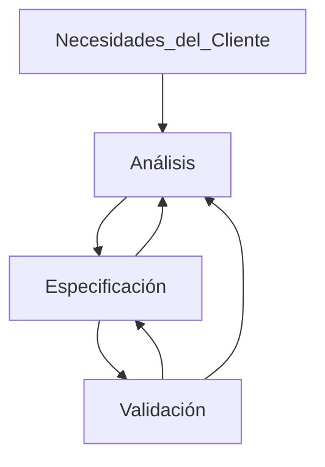

El **Proceso de requerimientos** es una secuencia de pasos que se realizan para convertir las necesidades del usuario en una SRS. Este proceso debe recolectar las necesidades y los requerimientos y especificarlos claramente. Se puede dividir en 3 actividades:
1. Análisis del problema o requerimientos: Mas difícil ya que exige recolección y extracción de estos
2. Especificación de los requerimientos
3. Validación

Este proceso no es lineal, es iterativo y en paralelo. Hay superposición entre las fases. Muchas veces especificar un requerimiento ayuda a su análisis, mientras que la validación puede mostrar brechas entre el análisis y su especificación 

La transición del análisis a la especificación es complicada. La especificación se enfoca en el comportamiento externo, mientas que el análisis tiene como objetivo comprender la estructura del problema y su dominio, sus componentes, entradas y salidas; además que en esta se recolecta mas información de la necesaria para dicha especificación. El uso del análisis y las estructuras que lo construyen puede ser indirecto, ayudando a comprender en lugar de asistir a la especificación

